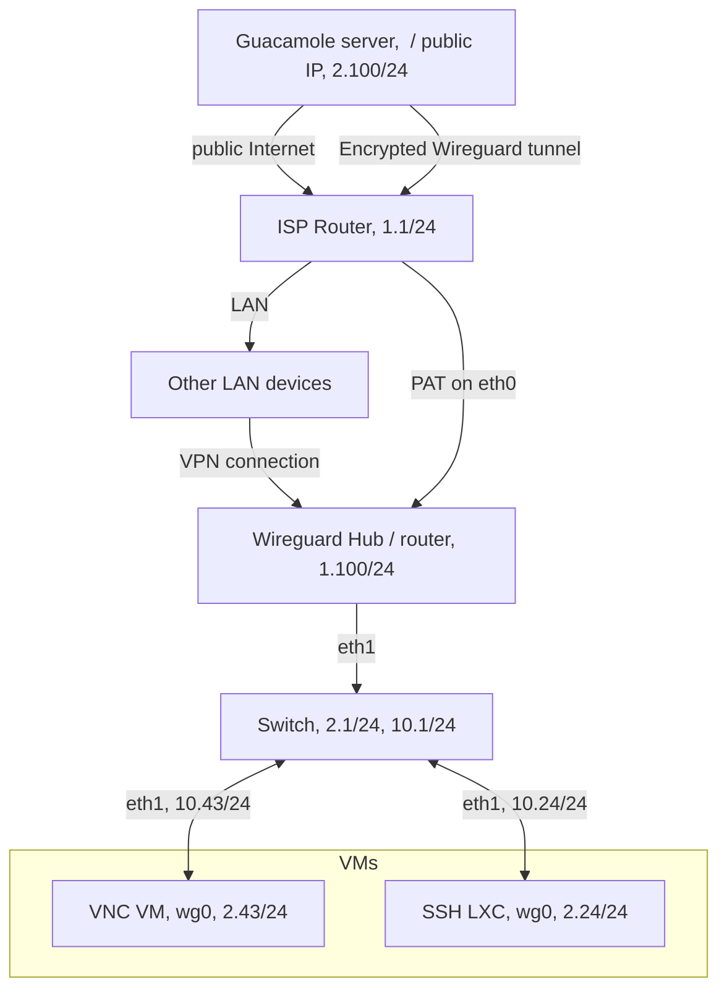

# Index
# Introduction

In this project I wanted to use systemd to get to know to which extend I am able to use it the right way. Therefore, I wanted to use the occasion to configure with this tool the host network interfaces, the dhcp server, the wireguard configuration, and the day to day "management" with networkctl.

As I've already made the wireguard setup only with wg-quick you will also find that configuration section.

Also, I am writing these lines lately regarding my schedule and I am experiencing the NixOS / Guix paradigm right now. So I am likely going to try to re-implement the server with theses one day.

# Configuration
## Tools installation
```
apt install wireguard nftables 
```
Systemd tooling should already be installed.

Also, please ensure your sshd configuration is correct and running to avoid issue later. 

## Networking configuration
This is the overview of the setup. In the reality my VMs are on a Proxmox VE cluster, but you really only need one VM or container or device with its own IPs to achieve this setup.
Also, there is anther link not displayed here from the ISP router to the outside.

**Here I have to use another router (a raspberry pi debian in my case) because my ISP router does not mange VLANs or different LANs even if it has multiple ethernet ports. The good point is then that I should be able to reproduce this setup - routing/DHCP/Segmentation/Firewalling/WG hosts management independamently from the ISP route (since you only need to perform a port openning + PAT).

Nontheless, you would may want to simply use the router functionnaliteis of your ISP. It is up to you - there are no reason this would not be acheivable.**

Here is the schema of the network's topology:

Now that we have that we are starting the systemd's networking part. Note that you can use any networking tool you desire. 

In this section we are working under the `/etc/systemd/network` directory. We have to write configuration files for `eth0`, `eth1` and `wg0` interfaces.

## Eth0 configuration
The easiest one is a classic ethernet interface that get a DHCP IPv4 lease and connects to LAN X.X.1.1/24. 
```
# /etc/systemd/network/10-eth0.network
[Match]
Name=eth0

[Network]
DHCP=yes
IPForward=yes
```

## Eth1 configuration 
The second interface will be linked to the isolated LAN. It will act as a DHCP server on this LAN.
```
# /etc/systemd/network/20-eth1.network
[Match]
Name=eth1

[Network]
Address=192.168.10.1/24
IPForward=ipv4
DHCPServer=true

[DHCPServer]
PoolOffset=10
PoolSize=100
DNS=192.168.10.1
```

* Notes that the IPForward parameter allow IPv4 forwarding for all interfaces as mentionned in the manual page of systemd.networking. 

## Configuring Wireguard interface
Here we have two files to build up our interface, a .netdev and a .network one. The Peer configuration itself is done in the netdev one. 

For the netdev file: 
```
# /etc/systemd/network/30-wg0.netdev
[NetDev]
Name=wg0
Kind=wireguard
Description="wg0 - Wireguard tunnel"

[WireGuard]
PrivateKey=<private-key>
ListenPort=51820

# Guacamole server 
[WireGuardPeer]
AllowedIPs=192.168.2.100/32
PublicKey=<guac-server-pubkey>

# LXC ssh
[WireGuardPeer]
AllowedIPs=192.168.2.24/32
PublicKey=<vm-ssh-pubkey>

# VM VNC
[WireGuardPeer]
AllowedIPs=192.168.2.43/32
PublicKey=<vm-vnc-pubkey>
```

After that, you need the .network
```
# /etc/systemd/network/30-wg0.network
[Match]
Name=wg0

[Network]
Address=192.168.2.1/24
# Not required since the setting is system-global
# IPForward=yes

[RoutingPolicyRule]
# Can always be useful
FirewallMark=0x8887
```
### Firewalling
For this part I will use nftables that is the (old) replacment of iptables. As far as I understood many current versions of ufw, firewalld or iptables are now using a nftables backend. 

Here I would like to use a configuration file and loading it to enhance replication possibilities. 
```
# /etc/nftables.conf
#!/usr/sbin/nft -f

flush ruleset

table inet filter {
	chain input {
        type filter hook input priority 0; policy drop;

        # Allow localhost traffic
        iifname lo accept

        # Allow established and related traffic
        ct state established,related accept

        # Allow SSH on the host. You can change the ssh port. 
        tcp dport 22 accept comment "accept ssh"

        # Allow DHCP from the eth1 side, since the DHCPServer is configured with systemd on eth1
        iifname eth1 udp dport 67 accept comment "accept DHCP requests from LAN10"
    
        # Allow DNS
        iifname eth1 udp dport 53 accept
        iifname eth1 tcp dport 53 accept
        
        # Allow ICMP for debugging purposes
        ip protocol icmp accept comment "accept icmp"
        ip6 nexthdr icmpv6 accept
            
        # Allow mdns
        udp dport mdns ip daddr 224.0.0.251 accept comment "Accept mDNS"
        udp dport mdns ip6 daddr ff02::fb accept comment "Accept mDNS"
            
        # Allow WireGuard
        udp dport 51820 accept comment "accept wireguard"
        
        # drop log
        log prefix "GOTCHA FILTER: "
    }

    chain forward {
        type filter hook forward priority 0; policy drop;

        ct state established, related accept comment "ct state forward accepted"
        # Allow forwarding from wg0 (WireGuard) to eth1 (LAN)
        # iifname wg0 oifname eth1 accept 

        # Allow forwarding from eth1 (LAN) to wg0 (WireGuard)
        # iifname eth1 oifname wg0 accept
        ip saddr 192.168.2.0/24 ip daddr 192.168.2.0/24 accept
 
        #  Allow DNS
        iifname eth0 udp sport 53 accept
        iifname eth0 tcp sport 53 accept
        
        # Allow LAN to Internet but block access to 192.168.1.0/24
        iifname eth1 oifname eth0 ip daddr 192.168.1.0/24 drop comment "Block to LAN1 FORWARD" 
        iifname eth1 oifname eth0 accept

        # Allow forward mDNS if required
        ip daddr 224.0.0.251 udp dport 5353 accept
        ip6 daddr ff02::fb udp dport 5353 accept

        # Allow forwarding from wg0 to the Internet
        iifname wg0 oifname eth0 ip daddr 192.168.1.0/24 drop comment "Block WireGuard to 192.168.1.0/24"
        iifname wg0 oifname eth0 accept

        # Allow from wg0 to 10.0/24 for now
        ip saddr 192.168.2.0/24 ip daddr 192.168.10.0/24 accept comment "Allow wg to LAN2 for now"
	
        #  Allow forwarding from wg0 to wg0 (following debugging)
        iifname wg0 oifname wg0 accept 
	
        # Drop other traffic
        log prefix "GOTCHA FORWARD: "
    }

    chain output {
        type filter hook output priority 0; policy accept;
    }
}

table ip nat {
    chain postrouting {
        type nat hook postrouting priority 100; policy accept;

        # Masquerade traffic from LAN to Internet
        oifname eth0 ip saddr 192.168.10.0/24 masquerade

        # Masquerade traffic from LAN to LAN1
        oifname eth1 ip saddr 192.168.10.0/24 masquerade
        
	# Masquerade traffic from WireGuard to Internet
        oifname eth0 ip saddr 192.168.2.0/24 masquerade
    }
}
```
Note that `DROP` statement are not compulsory. 

Also, please note that I am not a firewall expert and this one is kind of experimental. So please let a comment if you have some advice or obvious remarks on this conf file. 

### Starting and enabling services
Lastly we need to enable and start our services: 
```bash
systemctl enable --now systemd-networkd systemd-resolved nftables
```

Now everything should be up and running. You can especially check outputs of: 
```
networkctl status 
wg
```

And now hopefully everything is up and running! 

