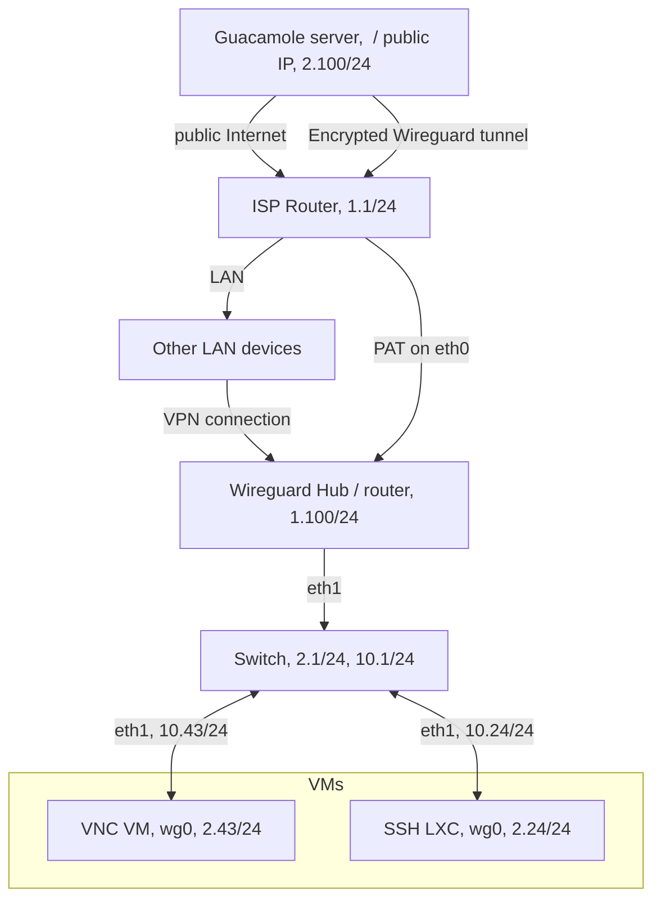

# Multi-platform Secure Remote Access (MSRA)
## Overview
This repo describes the PoC implementation for a multiplatform remote access onto resources. Here, resources corresponds to VMs hosted on a Proxmox VE server. But it could be basically anything. 

## Prerequisites
These elements must be available to follow this guide.
- Two accessible IPs - one for the Apache Guacamole server and one other for your back-to-machines router (it will may be your ISP router). Also depending on your setup you will may need some domain names or DynDNS domain names to ensure the reachability of these devices. There are some free options available. 
- A router capable of firwalling / manage wireguard "server" instance - it could be the same than your back-to-machine router 
- One container / VM / device to play the role of the reached machine through Apache Guacamole 

## RFC
I would be glad if you have some comments about this kind of work. If you want to describe issues, alternative, update or anything else please feel free to comment. The idea of not giving a fully automated script is also to ensure at least some people will run into the full configuration - and then "review" it in some manner.

Anyway, good reading and thanks in advance for your returns.

# Architecture
The idea of this project is to assemble differents bricks together.  

The idea here is to provide an access from any plateforms, it means here that we must be able to reach resources from a web browser. The Apache Guacamole serves this purpose perfectly. Deployed a tomcat9 server and a MariaDB database, these is deployed on a public cloud VPS to be publicly accessible.

This VPS then acts as a bastion. Some security and logging layers should be implemented too, in addition to the base system host hardening. 

Next, resources must be hosted somewhere on a non-public accessible site. Guacamole establishes connections to resources on this site. This could be either a working site or a homelab. To secure the connection and avoid eavesdropping or internal resource exposure, a Wireguard VPN access is setup. Only one port of the resource site is "open" (Wireguard is unresponsive to any unauthenticated packet - so appears closed to anyone else) with PAT configured to the Wireguard server. This Wireguard server acts as a second router connected to a specific LAN for accessible devices. 

# Content
## [The debian router and wirguard HUB](01_router-HUB.md)
## [VMs setup](02_VMs-setup.md)
## [Apache Guacamole and connections](03_guacamole-server.md)
## [Some hardening notes](04_hardening-notes.md)

# Used tech
## Wireguard
Wireguard is "extremely simple yet fast and modern VPN that utilizes state-of-the-art cryptography. It aims to be faster, simpler, leaner, and more useful than IPsec, while avoiding the massive headache". From my experience it is truely easy to setup with only three main sources of information: 
    - The wireguard [home page](https://www.wireguard.com/). 
    - The dedicated [Archwiki section](https://wiki.archlinux.org/title/WireGuard).
    - The Pro Custodibus [Wireguard](https://docs.procustodibus.com/guide/wireguard/) articles.

An important point to understand is that in a wireguard topology there is neither client nor server. All hosts are peers.:
Once the basics understood from the Wireguard documentation, we could use three different approaches (understand [differents topologies](https://www.procustodibus.com/blog/2020/10/wireguard-topologies/)):
    - A point to point configuration - Here for each connection, the Guacamole server should have a new peer and be able to reach them through the router firewall.
    - A Point to site configuration - the classical VPN client/server approach. 
    - A Hub and Spoke configuration where one peer is considered as an intermediate between multiple hosts. This peer acts as a router among the WireGuard endpoints.

I decided to keep the third option here. The topology is just a little bit easier because both the HUB and many spokes are behind the same router.   

## Apache Guacamole
From the official website: "[Apache Guacamole](https://guacamole.apache.org/) "is a clientless remote desktop gateway. It supports standard protocols like VNC, RDP, and SSH.

We call it clientless because no plugins or client software are required.

Thanks to HTML5, once Guacamole is installed on a server, all you need to access your desktops is a web browser." 

